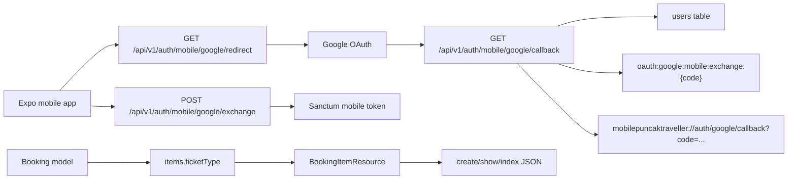

# Mobile OAuth and Booking Items Plan

## I. Executive Summary

- **Goal**: Add a mobile-specific Google OAuth API flow while keeping the shared `users` table, and enrich all booking responses with full booking item data.
- **Success Metrics**:
  - Existing web Google OAuth routes keep working unchanged while mobile OAuth uses separate API route names and mobile deep-link redirects.
  - Booking create, show, and index responses expose `items[]` with `ticketTierId`, `ticketName`, `quantity`, `unitPrice`, and `lineTotal`.
  - Targeted Laravel feature tests pass for booking item payloads and one-time mobile Google OAuth code exchange.

## II. Skill Matrix

| Component | Required Skill | Implementation Role |
|-----------|----------------|---------------------|
| Planning and sequencing | `planner` | Defines approval-gated staged backend implementation and verification. |
| Laravel API routes/resources | Laravel Boost guidelines from `AGENTS.md` | Keeps route versioning, Eloquent Resources, tests, and Pint formatting aligned with Laravel 13 conventions. |
| Booking response contract | Existing API resource patterns | Extends `BookingResource`, `BookingItemResource`, and booking card rows without changing database shape. |
| Mobile OAuth flow | Existing Socialite/Sanctum auth patterns | Adds mobile-specific Google redirect/callback/exchange routes while creating Sanctum tokens for the same `users` records. |

## III. Logic & Architecture

Implementation decisions:

- Mobile deep-link callback: `mobilepuncaktraveller://auth/google/callback`.
- Existing web OAuth routes remain under `auth/google/*`.
- New mobile OAuth routes should be separate, for example `auth/mobile/google/redirect`, `auth/mobile/google/callback`, and `auth/mobile/google/exchange`.
- User persistence stays in the existing `users` table using existing `email`, `google_id`, `avatar`, `role`, and `status` fields.
- Mobile tokens should use a distinct token name such as `mobile` while web/frontend tokens can keep their current naming.
- Booking list cards should include `items[]`, not only detail/create responses.

Important repository state:

- The backend working tree already contains uncommitted changes in files such as `BookingController.php`, `GalleryController.php`, `GalleryResource.php`, seeders, OpenAPI, and tests.
- Implementation must preserve and work with those changes. Do not revert unrelated files.

## IV. Phased Roadmap

## Stage 1: Context and Contract Audit
> **Entry Condition**: Plan is approved and backend working tree is inspected.
> **Exit Condition**: Existing booking/auth contracts, route names, and tests are identified before code edits.

### Module 1.1: Laravel Guidance and Route Audit

- [ ] [P1.1.1] Search Laravel Docs: Use the Laravel Boost `search-docs` tool for Socialite redirects, Sanctum token creation, validation, and Eloquent API Resources before backend code changes.
      depends_on: none
      Verify: Notes from docs search are available in implementation context; if Boost tools are unavailable, record the fallback and use existing project patterns.

- [ ] [P1.1.2] Inspect Existing Auth Routes: Confirm current web Google routes and exchange route names with `php artisan route:list --path=api/v1/auth --except-vendor`.
      depends_on: P1.1.1
      Verify: Output shows existing `api.v1.auth.google.redirect`, `api.v1.auth.google.callback`, and `api.v1.auth.google.exchange`.

- [ ] [P1.1.3] Inspect Booking Response Sources: Review `BookingController`, `BookingResource`, `BookingItemResource`, `CreateBooking`, and booking feature tests.
      depends_on: P1.1.1
      Verify: Confirm which responses already load `items.ticketType` and which responses need item arrays added.

### 🧪 Stage 1 Test Procedures

#### Test 1.1: Baseline Route and Test Discovery
- **Type**: Manual
- **Preconditions**: No implementation files have been edited for this task.
- **Steps**:
  1. Run `php artisan route:list --path=api/v1/auth --except-vendor`.
  2. Run `php artisan test --compact tests/Feature/Api/V1/BookingEndpointTest.php tests/Feature/Api/V1/GoogleOAuthExchangeTest.php`.
- **Expected Result**: Existing auth routes are visible; baseline tests either pass or any pre-existing failures are recorded before implementation.
- **Pass Command**: `php artisan route:list --path=api/v1/auth --except-vendor`
- **Fail Indicators**: Missing existing route names, syntax errors, or unrecorded baseline test failures.

## Stage 2: Booking Item Response Data
> **Entry Condition**: Stage 1 audit is complete.
> **Exit Condition**: Booking create, detail, and index responses include full `items[]` payloads.

### Module 2.1: Resource and Controller Contract

- [ ] [P2.1.1] Confirm Booking Item Shape: Keep `BookingItemResource` output as `ticketTierId`, `ticketName`, `quantity`, `unitPrice`, and computed `lineTotal`.
      depends_on: P1.1.3
      Verify: `BookingItemResource.php` exposes all five keys with integer casts for numeric fields.

- [ ] [P2.1.2] Ensure Create Response Loads Items: Verify `CreateBooking::execute()` returns bookings loaded with `event` and `items.ticketType`, and keep `BookingController::store()` returning `BookingResource`.
      depends_on: P2.1.1
      Verify: `POST /api/v1/bookings` response has `data.items.0.ticketName` and `data.items.0.lineTotal`.

- [ ] [P2.1.3] Ensure Detail Response Loads Items: Keep member `show()` loading `items.ticketType` and returning `BookingResource`.
      depends_on: P2.1.1
      Verify: `GET /api/v1/bookings/{reference}` response has `data.items[]` for member-owned bookings.

- [ ] [P2.1.4] Add Items to Booking Index Cards: Add an `items` key to member `bookingCard()` rows using the same `BookingItemResource` shape or a single shared formatter.
      depends_on: P2.1.1
      Verify: `GET /api/v1/bookings?status=upcoming` returns `data.0.items.0.ticketTierId`, `ticketName`, `quantity`, `unitPrice`, and `lineTotal`.

- [ ] [P2.1.5] Add Items to Admin Booking Rows: Ensure admin booking index/detail rows also expose full item data without losing existing `tickets`, `qty`, or CMS fields.
      depends_on: P2.1.4
      Verify: Admin `GET /api/v1/bookings` response includes both legacy `tickets` and full `items`.

### Module 2.2: Booking Tests

- [ ] [P2.2.1] Extend Booking Create Test: Update `BookingEndpointTest::test_authenticated_user_can_create_pending_booking_from_frontend_payload` to assert `data.items.0.*`.
      depends_on: P2.1.2
      Verify: Test asserts ticket ID, name, quantity, unit price, and line total.

- [ ] [P2.2.2] Extend Booking Listing Test: Update `test_account_booking_listing_returns_frontend_cards` to assert `data.0.items.0.*`.
      depends_on: P2.1.4
      Verify: Test catches missing item arrays in booking card rows.

- [ ] [P2.2.3] Add Booking Detail Test: Add or extend a member booking detail test to assert `data.items[]` is present on `show`.
      depends_on: P2.1.3
      Verify: Test fails if `BookingResource` is returned without loaded item details.

### 🧪 Stage 2 Test Procedures

#### Test 2.1: Booking Items in API Responses
- **Type**: Integration
- **Preconditions**: Stage 2 implementation is complete.
- **Steps**:
  1. Run booking endpoint tests.
  2. Inspect assertions for create, index, and show responses.
- **Expected Result**: All booking response paths include full `items[]` payloads with correct computed line totals.
- **Pass Command**: `php artisan test --compact tests/Feature/Api/V1/BookingEndpointTest.php`
- **Fail Indicators**: Missing `items`, missing `ticketName`, wrong `lineTotal`, or regressions in existing booking filters/cancellation tests.

#### Test 2.2: Admin Booking Compatibility
- **Type**: Integration
- **Preconditions**: Stage 2 implementation is complete.
- **Steps**:
  1. Run admin booking endpoint tests.
  2. Confirm existing admin fields still pass.
- **Expected Result**: Admin booking responses retain existing CMS fields and include full item payloads.
- **Pass Command**: `php artisan test --compact tests/Feature/Api/V1/AdminBookingEndpointTest.php`
- **Fail Indicators**: Removed `tickets`, incorrect `qty`, missing full `items`, or admin authorization regressions.

## Stage 3: Separate Mobile Google OAuth API
> **Entry Condition**: Stage 2 booking contract is complete.
> **Exit Condition**: Mobile Google OAuth uses separate routes and cache keys while persisting users in the existing `users` table.

### Module 3.1: Mobile Routes and Config

- [ ] [P3.1.1] Add Mobile Auth Routes: Add mobile-specific Google routes under `api/v1/auth/mobile/google/*` without removing or changing existing web Google routes.
      depends_on: P1.1.2
      Verify: `php artisan route:list --path=api/v1/auth/mobile --except-vendor` shows mobile redirect, callback, and exchange route names.

- [ ] [P3.1.2] Add Mobile Callback Config: Add a config/env-backed callback target with default `mobilepuncaktraveller://auth/google/callback`.
      depends_on: P3.1.1
      Verify: `.env.example` documents the mobile callback URL variable and config resolves a non-empty default.

- [ ] [P3.1.3] Keep Shared User Table: Reuse `User::updateOrCreate()` or an extracted helper so both web and mobile flows update the same `users` row by email/google ID.
      depends_on: P3.1.1
      Verify: No new user table or OAuth identity table is introduced.

### Module 3.2: Mobile OAuth Controller Flow

- [ ] [P3.2.1] Extract Google User Upsert Helper: Move duplicated Google user creation/update logic into a private method on `AuthController` or a small action class.
      depends_on: P3.1.3
      Verify: Web callback and mobile callback both call the same helper.

- [ ] [P3.2.2] Implement Mobile Redirect: Add a controller method that starts a stateless Google Socialite redirect for mobile and stores mobile state separately from web state.
      depends_on: P3.1.1, P3.1.2
      Verify: Mobile redirect route returns a Google redirect response and does not use the web frontend callback URL.

- [ ] [P3.2.3] Implement Mobile Callback: Add a controller method that receives Google callback, upserts the shared user, creates a `mobile` Sanctum token, stores a one-time exchange code under a mobile-specific cache key, and redirects to `mobilepuncaktraveller://auth/google/callback?code=...`.
      depends_on: P3.2.1, P3.2.2
      Verify: Mobile callback does not call `Auth::login()` or require a web session; it redirects to the mobile deep link with a 64-character exchange code.

- [ ] [P3.2.4] Implement Mobile Exchange: Add a mobile exchange method that consumes only mobile cache keys and returns the same auth JSON shape as email login: `user`, `token`, `tokenType`, `message`.
      depends_on: P3.2.3
      Verify: Mobile exchange code is single-use and cannot be exchanged through the web exchange endpoint.

- [ ] [P3.2.5] Preserve Web OAuth Behavior: Keep existing `auth/google/redirect`, `auth/google/callback`, and `auth/google/exchange` behavior and cache keys working.
      depends_on: P3.2.4
      Verify: Existing `GoogleOAuthExchangeTest` still passes.

### Module 3.3: Mobile OAuth Tests

- [ ] [P3.3.1] Add Mobile Exchange Test: Add a feature test proving a mobile exchange code returns the existing user row and token once, then fails on reuse.
      depends_on: P3.2.4
      Verify: Test asserts `user.email`, `token`, and second exchange failure.

- [ ] [P3.3.2] Add Cache Isolation Test: Add a feature test proving a web exchange code cannot be used on the mobile exchange route and a mobile code cannot be used on the web exchange route.
      depends_on: P3.2.4
      Verify: Both cross-route exchange attempts return validation errors.

- [ ] [P3.3.3] Add Route Registration Test: Assert mobile route names exist or use `route()` in tests for redirect/exchange endpoints.
      depends_on: P3.1.1
      Verify: Tests fail if mobile route names are removed.

### 🧪 Stage 3 Test Procedures

#### Test 3.1: Mobile OAuth Exchange
- **Type**: Integration
- **Preconditions**: Stage 3 implementation is complete.
- **Steps**:
  1. Seed a user in the existing `users` table.
  2. Put a mobile OAuth exchange payload in cache.
  3. POST the code to the mobile exchange route.
  4. POST the same code again.
- **Expected Result**: First request returns auth JSON for the existing user; second request returns validation failure and no token.
- **Pass Command**: `php artisan test --compact tests/Feature/Api/V1/GoogleOAuthExchangeTest.php`
- **Fail Indicators**: Code reuse works, token missing, user duplicated, or response shape differs from login.

#### Test 3.2: Web and Mobile OAuth Isolation
- **Type**: Integration
- **Preconditions**: Stage 3 implementation is complete.
- **Steps**:
  1. Create one cached web OAuth code and one cached mobile OAuth code.
  2. Try exchanging each code on the wrong endpoint.
  3. Exchange each code on the correct endpoint.
- **Expected Result**: Wrong endpoint attempts fail; correct endpoint attempts succeed once.
- **Pass Command**: `php artisan test --compact tests/Feature/Api/V1/GoogleOAuthExchangeTest.php`
- **Fail Indicators**: Web/mobile cache keys overlap, wrong endpoint succeeds, or existing web test regresses.

## Stage 4: Formatting, Documentation, and Final Verification
> **Entry Condition**: Stages 2 and 3 are complete.
> **Exit Condition**: PHP formatting, targeted tests, route inspection, and contract checks pass.

### Module 4.1: Formatting and API Contract Files

- [ ] [P4.1.1] Run Pint on Dirty PHP Files: Run `vendor/bin/pint --dirty --format agent` after PHP edits.
      depends_on: P3.3.3
      Verify: Pint reports formatted files or no changes needed.

- [ ] [P4.1.2] Update OpenAPI If Existing Contract Requires It: If `openapi.yaml` already describes auth or booking responses, update mobile OAuth routes and booking `items[]` schema.
      depends_on: P2.2.3, P3.3.3
      Verify: `openapi.yaml` includes mobile OAuth endpoints and booking item response fields if applicable.

- [ ] [P4.1.3] Update `.env.example`: Add mobile OAuth callback variable and keep existing web `FRONTEND_URL` guidance.
      depends_on: P3.1.2
      Verify: `.env.example` includes `MOBILE_FRONTEND_URL=mobilepuncaktraveller://` or equivalent callback config.

### Module 4.2: Final Test Run

- [ ] [P4.2.1] Run Booking Tests: Run booking feature tests after all response changes.
      depends_on: P4.1.1
      Verify: `php artisan test --compact tests/Feature/Api/V1/BookingEndpointTest.php tests/Feature/Api/V1/AdminBookingEndpointTest.php` passes.

- [ ] [P4.2.2] Run Google OAuth Tests: Run OAuth exchange tests after mobile route separation.
      depends_on: P4.1.1
      Verify: `php artisan test --compact tests/Feature/Api/V1/GoogleOAuthExchangeTest.php` passes.

- [ ] [P4.2.3] Inspect Routes: Run route list for auth endpoints.
      depends_on: P4.2.2
      Verify: Both web and mobile Google OAuth route groups are present.

- [ ] [P4.2.4] Inspect Git Diff: Review `git status --short` and `git diff --stat`, separating this work from pre-existing unrelated backend changes.
      depends_on: P4.2.3
      Verify: No unrelated user changes are reverted or overwritten.

### 🧪 Stage 4 Test Procedures

#### Test 4.1: Targeted Backend Regression Suite
- **Type**: Integration
- **Preconditions**: All implementation stages are complete and Pint has run.
- **Steps**:
  1. Run booking feature tests.
  2. Run admin booking feature tests.
  3. Run Google OAuth exchange tests.
- **Expected Result**: All targeted tests pass with no warnings that indicate missing response fields or route names.
- **Pass Command**: `php artisan test --compact tests/Feature/Api/V1/BookingEndpointTest.php tests/Feature/Api/V1/AdminBookingEndpointTest.php tests/Feature/Api/V1/GoogleOAuthExchangeTest.php`
- **Fail Indicators**: Failed JSON path assertions, route generation errors, validation shape regressions, or code reuse vulnerabilities.

#### Test 4.2: Auth Route Contract
- **Type**: Manual
- **Preconditions**: All implementation stages are complete.
- **Steps**:
  1. Run `php artisan route:list --path=api/v1/auth --except-vendor`.
  2. Confirm web routes remain under `auth/google/*`.
  3. Confirm mobile routes exist under `auth/mobile/google/*`.
- **Expected Result**: Both route families exist and have distinct names.
- **Pass Command**: `php artisan route:list --path=api/v1/auth --except-vendor`
- **Fail Indicators**: Existing web routes removed, mobile routes missing, route names colliding, or mobile exchange pointing at web cache key.

## V. Final Verification Checklist

- [ ] Laravel docs have been searched or an explicit fallback recorded before implementation.
- [ ] Existing web Google OAuth routes remain unchanged.
- [ ] Mobile Google OAuth routes exist separately under `api/v1/auth/mobile/google/*`.
- [ ] Mobile callback redirects to `mobilepuncaktraveller://auth/google/callback?code=...`.
- [ ] Web and mobile OAuth exchange codes use isolated cache keys.
- [ ] Both OAuth flows upsert the same `users` table records.
- [ ] Booking create response includes `data.items[]`.
- [ ] Booking detail response includes `data.items[]`.
- [ ] Booking index/card response includes `data.0.items[]`.
- [ ] Admin booking responses retain existing fields and include full item data.
- [ ] `vendor/bin/pint --dirty --format agent` has run after PHP edits.
- [ ] Targeted booking and OAuth tests pass.
- [ ] Existing dirty backend changes are preserved.
