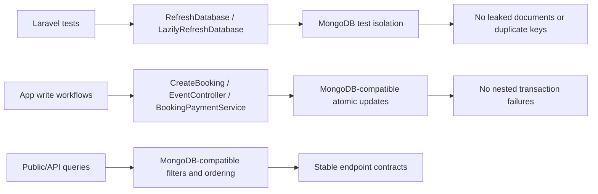

# MongoDB Migration Cleanup

## I. Executive Summary

- **Goal**: Bring the Laravel API repository back to a clean MongoDB-compatible state with zero repo-owned lint warnings and a passing automated test suite.
- **Success Metrics**:
  - `composer run lint:check` passes for repo-owned PHP files.
  - `npm run lint:check` and `npm run types:check` remain passing.
  - `php artisan test --compact` passes without MongoDB transaction, duplicate-key, ordering, or authentication failures.

## II. Skill Matrix

| Component | Required Skill | Implementation Role |
|-----------|----------------|---------------------|
| Laravel API models, services, controllers, migrations, tests | `planner`, `laravel-best-practices` | Sequence the migration cleanup and apply Laravel conventions for Eloquent, transactions, migrations, resources, and PHPUnit. |
| MongoDB persistence and test isolation | `laravel-best-practices` | Replace relational/transaction assumptions with MongoDB-compatible query and test patterns. |
| PHP formatting and import cleanup | `laravel-best-practices` / Pint | Remove repo-owned formatting warnings using the project formatter. |
| Frontend build checks inside API repo | Existing Node scripts | Confirm the API repo’s React/Inertia tooling remains unaffected. |

## III. Logic & Architecture

The migration cleanup has three primary fault lines:

The plan deliberately avoids changing third-party Composer PHAR deprecation notices unless they are caused by repo-owned configuration. The initial diagnostic run shows those notices originate from the global Composer runtime, while the repo-owned failures are Pint import/style warnings and PHPUnit failures caused by MongoDB transaction semantics, leaked test data, duplicate unique keys, and one event ordering assertion.

## IV. Phased Roadmap

## Stage 1: Reproduce and Bound the Migration Failures
> **Entry Condition**: The working tree is available at `/Users/aliceevr/Documents/Workspace/SV IPB University/Puncak Traveller/api-puncak-traveller`.
> **Exit Condition**: The failing checks are classified into repo-owned MongoDB migration issues and out-of-scope upstream runtime notices.

### Module 1.1: Repository Index

- [ ] [P1.1.1] Build API File Index: Enumerate `app`, `config`, `database`, `routes`, and `tests` files that participate in the API runtime.
      depends_on: none
      Verify: `find app config database routes tests -maxdepth 3 -type f | sort` completes and shows Laravel API, migrations, factories, seeders, and PHPUnit tests.

- [ ] [P1.1.2] Identify MongoDB Touchpoints: Search models, migrations, services, controllers, factories, seeders, config, and tests for MongoDB, relational schema, transaction, and key assumptions.
      depends_on: P1.1.1
      Verify: `rg -n "mongodb|MongoDB|DB::transaction|lockForUpdate|RefreshDatabase|LazilyRefreshDatabase|foreignId|constrained|whereBelongsTo|whereKey|public_id|_id" app config database routes tests -S` produces the working migration map.

### Module 1.2: Baseline Diagnostics

- [ ] [P1.2.1] Run PHP Formatter Check: Capture repo-owned Pint warnings before code edits.
      depends_on: P1.1.1
      Verify: `composer run lint:check` reports only repo-owned Pint issues or passes.

- [ ] [P1.2.2] Run Frontend Static Checks: Confirm API repo Node tooling is not part of the MongoDB regression.
      depends_on: P1.1.1
      Verify: `npm run lint:check && npm run types:check` exits with code 0.

- [ ] [P1.2.3] Run PHPUnit Baseline: Capture the current feature/unit failure classes.
      depends_on: P1.1.2
      Verify: `php artisan test --compact` reports MongoDB transaction, duplicate-key leakage, ordering, or auth/session failures.

### Module 1.3: Version-Specific Guidance

- [ ] [P1.3.1] Check Available Laravel Docs Tooling: Attempt to locate the project’s Laravel Boost `search-docs` capability before backend edits.
      depends_on: P1.1.1
      Verify: Tool discovery confirms whether `search-docs` is available; if unavailable, proceed using installed package code and official package behavior already present in `vendor/`.

- [ ] [P1.3.2] Inspect Installed MongoDB Laravel Behavior: Read the installed MongoDB Laravel transaction and model traits relevant to the failing stack traces.
      depends_on: P1.3.1
      Verify: `rg -n "function transaction|function beginTransaction|with_transaction|DocumentModel|class Model" vendor/mongodb/laravel-mongodb/src vendor/mongodb/mongodb/src -S` identifies the APIs used by the failing code.

### 🧪 Stage 1 Test Procedures

#### Test 1.1: Baseline Check Inventory
- **Type**: Manual
- **Preconditions**: Dependencies are installed in the API repo.
- **Steps**:
  1. Run `composer run lint:check`.
  2. Run `npm run lint:check`.
  3. Run `npm run types:check`.
  4. Run `php artisan test --compact`.
- **Expected Result**: The baseline output classifies Pint warnings, passing Node checks, and MongoDB-related PHPUnit failures.
- **Pass Command**: `composer run lint:check; npm run lint:check; npm run types:check; php artisan test --compact`
- **Fail Indicators**: Missing dependencies, non-MongoDB fatal bootstrap errors, or inability to run Artisan.

#### Test 1.2: Scope Guard
- **Type**: Manual
- **Preconditions**: Test 1.1 output is available.
- **Steps**:
  1. Separate warnings from `/usr/local/bin/composer` or Composer PHAR internals from warnings in repository files.
  2. Separate PHPUnit failures caused by MongoDB transactions/test data from unrelated application contract failures.
- **Expected Result**: Repo-owned remediation targets are listed; third-party Composer PHP 8.5 deprecations are not treated as application migration regressions.
- **Fail Indicators**: The plan attempts to modify vendor files, Composer PHAR internals, or unrelated frontend code.

## Stage 2: Make PHPUnit Isolation MongoDB-Compatible
> **Entry Condition**: Stage 1 has identified transaction and duplicate-key failures in the test suite.
> **Exit Condition**: Each PHPUnit test starts from deterministic MongoDB state without relying on unsupported per-test transactions.

### Module 2.1: Test Database Lifecycle

- [ ] [P2.1.1] Design MongoDB Test Reset Strategy: Replace test transaction reliance with a shared test reset path that drops or clears MongoDB collections before tests.
      depends_on: P1.2.3, P1.3.2
      Verify: Manual inspection confirms the strategy does not call `beginTransaction()` for MongoDB test isolation.

- [ ] [P2.1.2] Implement Base Test Reset Hook: Add the MongoDB reset behavior to `tests/TestCase.php` or a small trait used by API tests, following existing PHPUnit conventions.
      depends_on: P2.1.1
      Verify: Running `php artisan test --compact --filter=AuthEndpointTest` no longer reports duplicate key leakage from previous tests.

- [ ] [P2.1.3] Remove Incompatible Refresh Traits: Replace `RefreshDatabase` and `LazilyRefreshDatabase` usage in tests with the MongoDB-compatible reset hook.
      depends_on: P2.1.2
      Verify: `rg -n "RefreshDatabase|LazilyRefreshDatabase|DatabaseTransactions" tests -S` returns no incompatible usage.

### Module 2.2: Session and Unit Test Compatibility

- [ ] [P2.2.1] Fix Unit Test Bootstrapping: Remove framework database/session setup from pure unit placeholder tests or convert them into feature tests if framework state is required.
      depends_on: P2.1.2
      Verify: `php artisan test --compact tests/Unit/ExampleTest.php` passes without `startSession()` on null.

- [ ] [P2.2.2] Verify Auth Test State: Ensure registration, login, verification, password, and settings tests use isolated users and do not leak MongoDB documents.
      depends_on: P2.1.3, P2.2.1
      Verify: `php artisan test --compact tests/Feature/Auth tests/Feature/Settings` passes without duplicate keys or transaction-number errors.

### 🧪 Stage 2 Test Procedures

#### Test 2.1: Duplicate-Key Isolation
- **Type**: Integration
- **Preconditions**: MongoDB reset hook is implemented and incompatible refresh traits are removed.
- **Steps**:
  1. Run `php artisan test --compact tests/Feature/Api/V1/AuthEndpointTest.php`.
  2. Run `php artisan test --compact tests/Feature/Api/V1/MidtransPaymentNotificationTest.php`.
- **Expected Result**: Tests can create repeated emails, references, slugs, and public IDs across methods without `E11000 duplicate key` errors.
- **Pass Command**: `php artisan test --compact tests/Feature/Api/V1/AuthEndpointTest.php tests/Feature/Api/V1/MidtransPaymentNotificationTest.php`
- **Fail Indicators**: Any `E11000 duplicate key error`, leaked record count, or stale document from a previous test.

#### Test 2.2: No Test Harness Transactions
- **Type**: Integration
- **Preconditions**: MongoDB is configured as the PHPUnit database connection.
- **Steps**:
  1. Run `rg -n "RefreshDatabase|LazilyRefreshDatabase|DatabaseTransactions" tests -S`.
  2. Run `php artisan test --compact tests/Feature/Auth/AuthenticationTest.php`.
- **Expected Result**: The grep command finds no incompatible traits; authentication tests do not emit `Transaction numbers are only allowed on a replica set member or mongos`.
- **Pass Command**: `php artisan test --compact tests/Feature/Auth/AuthenticationTest.php`
- **Fail Indicators**: Any transaction-number error, `Transaction already in progress`, or incompatible trait reference.

## Stage 3: Remove MongoDB-Incompatible App Transactions and Locks
> **Entry Condition**: Stage 2 provides deterministic test isolation.
> **Exit Condition**: App write workflows no longer start nested/unsupported MongoDB transactions during normal requests or tests.

### Module 3.1: Booking Creation

- [ ] [P3.1.1] Refactor `CreateBooking` Transaction Boundary: Replace the `DB::transaction()` wrapper and `lockForUpdate()` assumption with MongoDB-compatible atomic conditional updates.
      depends_on: P2.1.3, P1.3.2
      Verify: `php artisan test --compact tests/Feature/Actions/CreateBookingTest.php` reaches booking assertions without transaction errors.

- [ ] [P3.1.2] Preserve Oversell Protection: Keep the conditional `sold` increment guard and explicit conflict messages for insufficient ticket stock.
      depends_on: P3.1.1
      Verify: `php artisan test --compact --filter=test_booking_creation_rejects_overselling` passes and reports the expected `Only 1` message.

- [ ] [P3.1.3] Preserve Idempotency: Ensure existing booking lookup by user and `idempotency_key` still returns the original booking with event/items loaded.
      depends_on: P3.1.1
      Verify: `php artisan test --compact --filter=test_booking_creation_is_idempotent_for_retried_requests` passes.

### Module 3.2: Event Admin Writes

- [ ] [P3.2.1] Refactor Event Store/Update Transaction Boundary: Replace `DB::transaction()` wrappers in admin event create/update paths with sequential writes plus existing conflict checks.
      depends_on: P2.1.3, P1.3.2
      Verify: `php artisan test --compact tests/Feature/Api/V1/AdminEventEndpointTest.php tests/Feature/Api/V1/AdminAuthorizationTest.php` passes without transaction errors.

- [ ] [P3.2.2] Preserve Ticket Sync Constraints: Ensure ticket capacity cannot go below sold count and sold ticket tiers cannot be removed.
      depends_on: P3.2.1
      Verify: Existing admin event tests covering ticket create/update/delete constraints pass.

### Module 3.3: Booking Payment State Changes

- [ ] [P3.3.1] Refactor Payment Service Transaction Boundary: Remove `DB::transaction()` and `lockForUpdate()` usage from payment status, cancellation, refund, and stock release flows.
      depends_on: P2.1.3, P1.3.2
      Verify: `php artisan test --compact tests/Feature/Api/V1/MidtransPaymentNotificationTest.php tests/Feature/Api/V1/AdminBookingEndpointTest.php tests/Feature/Api/V1/BookingEndpointTest.php` passes without transaction errors.

- [ ] [P3.3.2] Preserve Idempotent Stock Release: Keep `stock_released_at` semantics so failed/refunded/cancelled bookings release stock once.
      depends_on: P3.3.1
      Verify: `php artisan test --compact --filter=restores_ticket_stock_once` passes.

### 🧪 Stage 3 Test Procedures

#### Test 3.1: Booking Atomicity
- **Type**: Integration
- **Preconditions**: MongoDB-compatible test isolation is active.
- **Steps**:
  1. Run `php artisan test --compact tests/Feature/Actions/CreateBookingTest.php`.
  2. Run `php artisan test --compact tests/Feature/Api/V1/BookingEndpointTest.php`.
- **Expected Result**: Booking creation, idempotency, oversell rejection, listing, and cancellation tests pass without transaction errors.
- **Pass Command**: `php artisan test --compact tests/Feature/Actions/CreateBookingTest.php tests/Feature/Api/V1/BookingEndpointTest.php`
- **Fail Indicators**: `Transaction already in progress`, oversold stock, wrong conflict message, missing booking items, or repeated stock release.

#### Test 3.2: Admin Event and Payment Workflows
- **Type**: Integration
- **Preconditions**: Refactored event and payment write paths are in place.
- **Steps**:
  1. Run `php artisan test --compact tests/Feature/Api/V1/AdminEventEndpointTest.php tests/Feature/Api/V1/AdminAuthorizationTest.php`.
  2. Run `php artisan test --compact tests/Feature/Api/V1/AdminBookingEndpointTest.php tests/Feature/Api/V1/MidtransPaymentNotificationTest.php`.
- **Expected Result**: Admin event writes, authorization, receipt resend/download, Midtrans notifications, and payment sync tests pass.
- **Pass Command**: `php artisan test --compact tests/Feature/Api/V1/AdminEventEndpointTest.php tests/Feature/Api/V1/AdminAuthorizationTest.php tests/Feature/Api/V1/AdminBookingEndpointTest.php tests/Feature/Api/V1/MidtransPaymentNotificationTest.php`
- **Fail Indicators**: Transaction errors, 500 responses, duplicate keys, incorrect payment status, or stock not restored exactly once.

## Stage 4: Fix MongoDB Query and Contract Regressions
> **Entry Condition**: Transaction and test isolation failures are resolved.
> **Exit Condition**: Public/admin API endpoint tests pass under MongoDB semantics.

### Module 4.1: Public Event Ordering

- [ ] [P4.1.1] Stabilize Public Event Date Ordering: Adjust event ordering or test setup so newest upcoming events sort ahead of older upcoming events and completed events sort last under MongoDB.
      depends_on: P3.2.1
      Verify: `php artisan test --compact --filter=test_events_default_order_prioritizes_newest_upcoming_and_completed_last` passes.

- [ ] [P4.1.2] Verify Search and Status Filters: Confirm MongoDB-compatible text matching and relationship filters preserve the public API contract.
      depends_on: P4.1.1
      Verify: `php artisan test --compact --filter=test_events_can_be_filtered_by_activity_search_and_status` passes.

### Module 4.2: Authentication and Session Contracts

- [ ] [P4.2.1] Fix Registration Auth Persistence: Ensure registered users are authenticated under MongoDB-backed `User` and session configuration.
      depends_on: P2.2.2
      Verify: `php artisan test --compact tests/Feature/Auth/RegistrationTest.php` passes.

- [ ] [P4.2.2] Verify Sanctum Token Model Compatibility: Confirm `PersonalAccessToken` continues to use MongoDB and API login returns a usable token/session payload.
      depends_on: P4.2.1
      Verify: `php artisan test --compact tests/Feature/Api/V1/AuthEndpointTest.php tests/Feature/Api/V1/GoogleOAuthExchangeTest.php` passes.

### Module 4.3: Resource Identifier Consistency

- [ ] [P4.3.1] Audit Resource ID Serialization: Ensure resources cast MongoDB ObjectIds and public IDs consistently for `eventId`, `community_id`, `ticketTierId`, and booking item IDs.
      depends_on: P3.1.3, P3.3.1
      Verify: `php artisan test --compact tests/Feature/Api/V1/PublicApiEndpointTest.php tests/Feature/Api/V1/BookingEndpointTest.php` passes resource shape assertions.

### 🧪 Stage 4 Test Procedures

#### Test 4.1: Public API Contract
- **Type**: Integration
- **Preconditions**: MongoDB-compatible write and reset flows are complete.
- **Steps**:
  1. Run `php artisan test --compact tests/Feature/Api/V1/PublicApiEndpointTest.php`.
  2. Inspect any failing response JSON assertions.
- **Expected Result**: Event ordering, filtering, gallery/contact methods, and landing payload tests pass with expected IDs and ordering.
- **Pass Command**: `php artisan test --compact tests/Feature/Api/V1/PublicApiEndpointTest.php`
- **Fail Indicators**: Wrong first event ID, completed events appearing before upcoming events, missing resource fields, or duplicate key leakage.

#### Test 4.2: Auth and API Identity Contract
- **Type**: Integration
- **Preconditions**: MongoDB `User` and Sanctum token models are active.
- **Steps**:
  1. Run `php artisan test --compact tests/Feature/Auth tests/Feature/Api/V1/AuthEndpointTest.php tests/Feature/Api/V1/GoogleOAuthExchangeTest.php`.
  2. Confirm login, registration, verification, OAuth exchange, and token creation assertions pass.
- **Expected Result**: Auth and identity tests pass with authenticated sessions and valid token responses.
- **Pass Command**: `php artisan test --compact tests/Feature/Auth tests/Feature/Api/V1/AuthEndpointTest.php tests/Feature/Api/V1/GoogleOAuthExchangeTest.php`
- **Fail Indicators**: User not authenticated, wrong guard/provider behavior, token model write failure, or duplicate emails.

## Stage 5: Formatting and Final Verification
> **Entry Condition**: MongoDB-related PHPUnit failures are resolved.
> **Exit Condition**: Repo-owned checks pass and only out-of-scope third-party runtime deprecations remain, if the local Composer PHAR still emits them.

### Module 5.1: PHP Style Cleanup

- [ ] [P5.1.1] Run Pint on Dirty PHP Files: Apply the project formatter to touched PHP files and existing Pint-reported import/style warnings.
      depends_on: P3.3.2, P4.3.1
      Verify: `vendor/bin/pint --dirty --format agent` completes.

- [ ] [P5.1.2] Verify PHP Lint Check: Ensure repo-owned PHP formatting warnings are gone.
      depends_on: P5.1.1
      Verify: `composer run lint:check` exits with code 0 or only emits third-party Composer PHAR deprecations before running Pint.

### Module 5.2: Full Suite

- [ ] [P5.2.1] Run Frontend Checks Again: Confirm backend changes did not affect Inertia/React tooling in the API repo.
      depends_on: P5.1.2
      Verify: `npm run lint:check && npm run types:check` exits with code 0.

- [ ] [P5.2.2] Run Full PHPUnit Suite: Confirm all API tests pass after MongoDB cleanup.
      depends_on: P5.1.2
      Verify: `php artisan test --compact` exits with code 0.

- [ ] [P5.2.3] Review Git Diff: Ensure no vendor files, generated dependency folders, or unrelated frontend/mobile files were modified.
      depends_on: P5.2.1, P5.2.2
      Verify: `git status --short && git diff --stat` shows only intended API repo changes.

### 🧪 Stage 5 Test Procedures

#### Test 5.1: Static Verification
- **Type**: Integration
- **Preconditions**: All code edits are complete and Pint has been run.
- **Steps**:
  1. Run `composer run lint:check`.
  2. Run `npm run lint:check`.
  3. Run `npm run types:check`.
- **Expected Result**: PHP formatter check, ESLint, and TypeScript checks pass.
- **Pass Command**: `composer run lint:check && npm run lint:check && npm run types:check`
- **Fail Indicators**: Pint file list, ESLint violations, TypeScript errors, or repo-owned PHP deprecation warnings.

#### Test 5.2: Full Regression Suite
- **Type**: Integration
- **Preconditions**: Static verification passes.
- **Steps**:
  1. Run `php artisan test --compact`.
  2. Confirm the summary reports all tests passing, allowing only intentionally skipped tests.
- **Expected Result**: The suite exits with code 0; no MongoDB transaction, duplicate-key, order, or auth failures remain.
- **Pass Command**: `php artisan test --compact`
- **Fail Indicators**: Any failed test, error, unexpected skip, `Transaction already in progress`, `Transaction numbers are only allowed on a replica set member or mongos`, or `E11000 duplicate key error`.

## V. Final Verification Checklist

- [ ] `composer run lint:check` passes for repo-owned PHP files.
- [ ] `npm run lint:check` passes.
- [ ] `npm run types:check` passes.
- [ ] `php artisan test --compact` passes.
- [ ] `rg -n "RefreshDatabase|LazilyRefreshDatabase|DatabaseTransactions" tests -S` returns no incompatible test transaction traits.
- [ ] `rg -n "DB::transaction|lockForUpdate" app tests -S` returns no MongoDB-incompatible transaction or lock usage, or each remaining occurrence is documented as safe for the configured MongoDB topology.
- [ ] `git diff --stat` contains only intentional API repo changes.
